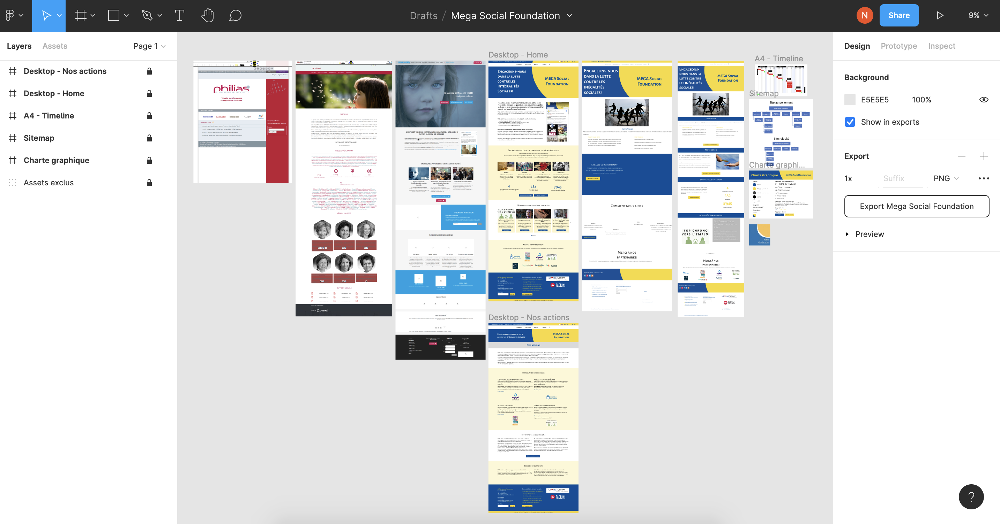

# Projet de MEGA Social Foundation
Le site est : [www.megasocialfoundation.org](https://www.megasocialfoundation.org)

Je travaille dans un projet de formation nommé [Adaflow](https://adaflow.ch) sous le programme Web 360° de l'association [Powerhouse à Lausanne](https://powerhouse-lausanne.ch) qui a pour 2 objectifs : 
- de soutenir l'intégration professionnelle des participant·e·s et de répondre aux besoins du marché.
- de développer sa carrière dans le web et la transformation Digitale.

La fondation n'ayant pas les moyens financiers pour réaliser leur site, le projet a été proposé aux étudiants du programme, et ainsi de mettre en pratique les appris.

## Ma partie, étape par étape : 
Un cahier des charges a été réalisé en commun avec les autres étudiants et la cliente. À l'aide de [Figma](https://www.figma.com), de la version en ligne du site et des anciennes versions du site récupérées sur [archive.org](http://archive.org), j'ai réalisé une maquette fonctionnelle:

Cette maquette à été validée par le formateur [Yannick Burky](https://adaflow.ch/a-propos/) avec grande satisfaction. 

## Construction du site statique
Cette opportunité m'a permis de mettre à jour mes connaissances de Bootstrap, de la version 3 que je connaissais bien, à la version 5 actuelle.

J'ai construit 2 pages : l'accueil et un page contenu. 

J'ai présenté mon travail à mon formateur [Yannick Burky](https://adaflow.ch/a-propos/) qui était très satisfait de mon travail et m'a donné la permission de poster le code sur Github.

Je vous présente deux pages en ligne : 
- https://n23dev.github.io/Mega-Social-foundation/index.html
- https://n23dev.github.io/Mega-Social-foundation/page.html